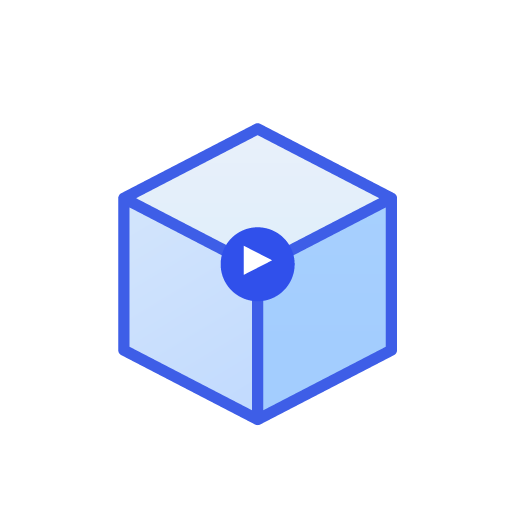
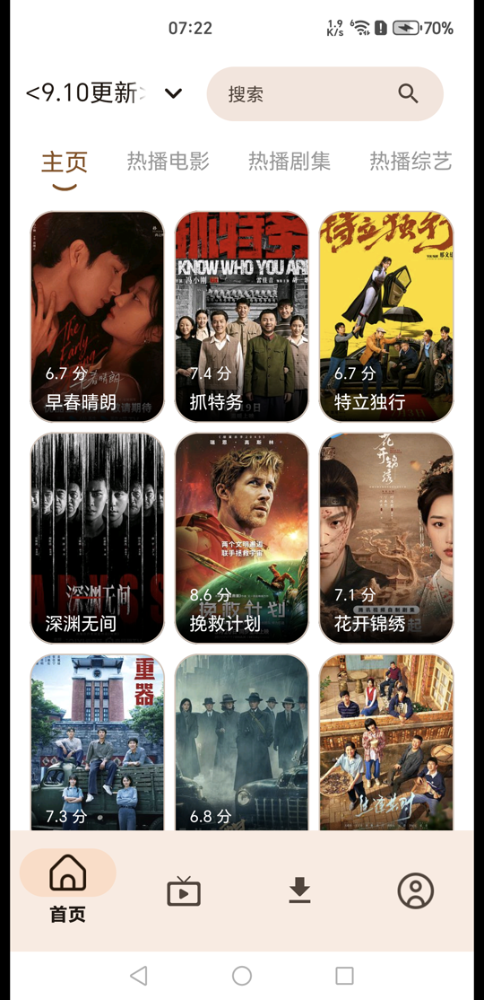
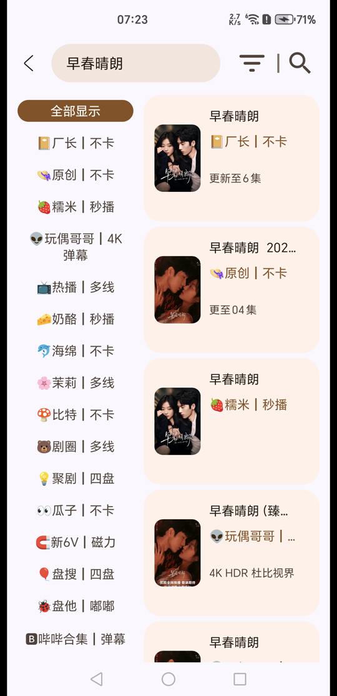
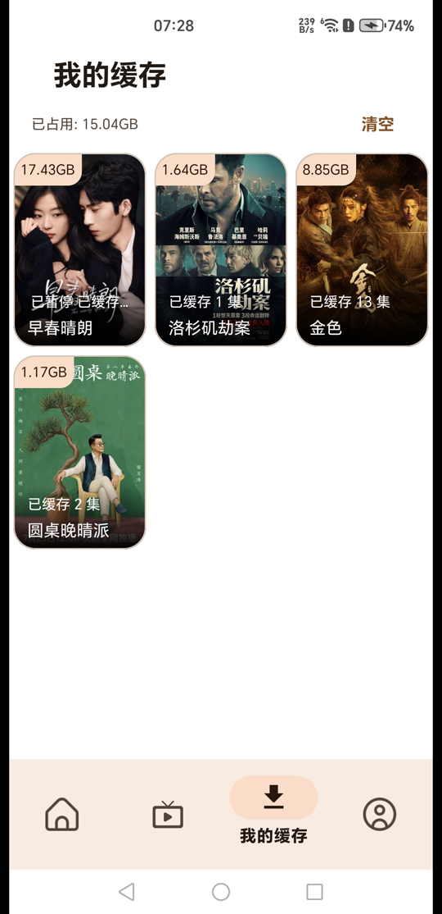
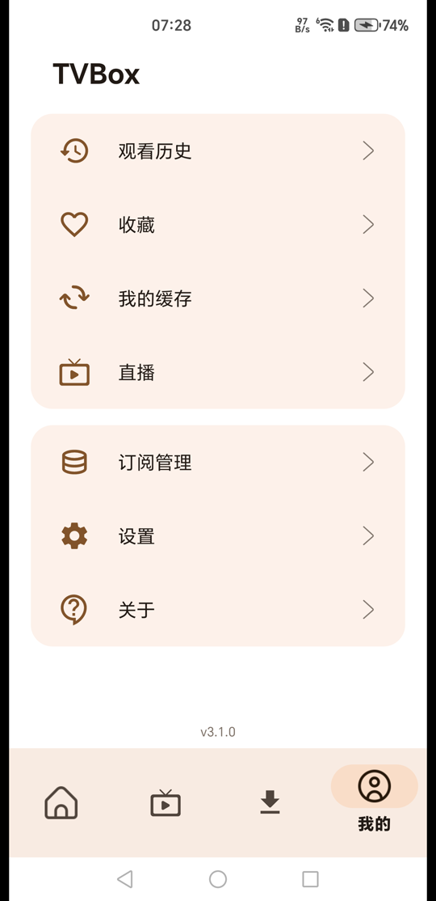
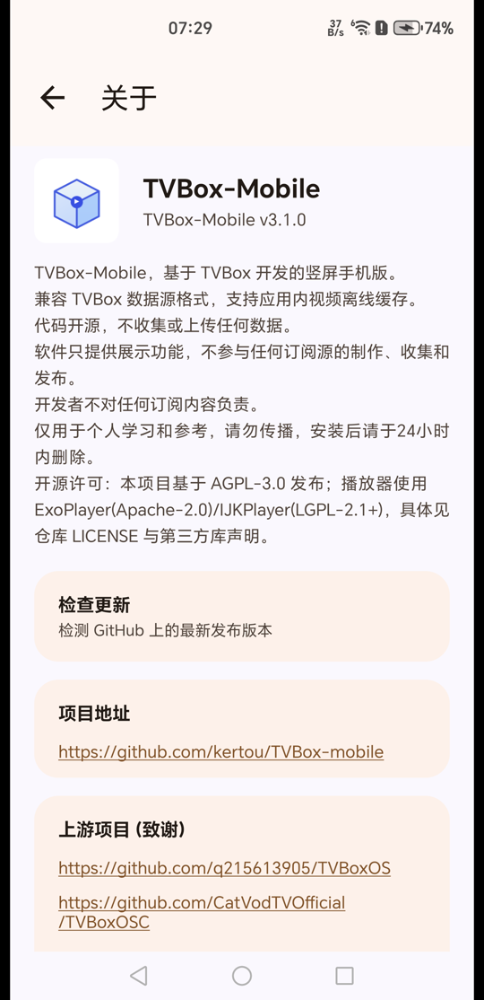

  
  <h1>TVBox-Mobile</h1>
  
<b>基于 Material 3 的安卓影视聚合播放器，竖屏单手操作，内置离线缓存</b>

TVBox-Mobile 是一款 Android 影视聚合播放器，基于 [XiaoRanLiu3119/TVBoxOS-Mobile](https://github.com/XiaoRanLiu3119/TVBoxOS-Mobile) 发展而来，完整兼容 TVBox 通用数据源配置。整套界面遵循 Google Material 3 规范打造，支持动态取色与完整深色模式。

项目的目标是让 TVBox 生态的数据源能力在手机上拥有原生级的体验：单手竖屏浏览、随点随播，并像主流视频应用一样把整季剧集缓存到本地、离线无忧观看。

----------

----------

本仓库处于积极维护状态，基本保持一周更新的频率，欢迎提交 Issue 反馈问题与建议。

主要特性：

- 基于 Google Material 3 构建：Android 12+ 跟随壁纸动态取色（Material You），低版本自动回退品牌蓝，深浅色两套主题全局自适应
- 竖屏单手交互：底部导航、海报流，浏览、选集、播放、缓存管理一屏完成，区别于 TV 横屏盒子应用
- 兼容 TVBox 数据源：订阅链接导入、多订阅管理、单选切换，普通接口源与 Spider 扩展源（内置 QuickJS 运行时）均可使用
- 应用内离线缓存：HLS（m3u8，含 AES-128 加密流）与渐进式直链双引擎，多线程分片并发下载，断点续传精确到分片，每集合并为单个 MP4
- 需要在线解析（parse=1）的集数同样支持缓存：内置后台解析管线（JSON 解析接口、WebView 网页嗅探）解析出真实地址后下载
- 双播放内核 ExoPlayer / IJKPlayer，DLNA 投屏，直播、收藏、观看历史、聚合搜索

注意：本项目是一个本地播放器框架，不包含、不提供任何影视资源或数据源接口，应用内展示的一切内容均来自用户自行配置的订阅与数据源，开发者不对任何订阅内容负责。本项目仅用于个人学习与技术交流，请遵守所在地法律法规。

## 截图

| 首页 | 详情与选集 | 我的缓存 | 我的 | 关于 |
|------|-----------|---------|------|------|
|  |  |  |  |  |

## 下载安装

从 [Releases](https://github.com/kertou/TVBox-mobile/releases/latest) 页面下载最新 APK 安装（当前仅提供 arm64-v8a）。全新安装后需在"我的 - 订阅管理"中自行添加数据源订阅，应用本身不内置任何资源。

## 离线缓存

- 详情页"下载"打开缓存选集弹窗：整剧全选 / 反选 / 仅当前集 / 自定义多选，保留 1DM 作为外部下载次选入口
- 前台服务与常驻进度通知（总进度、速度、可暂停），每集完成后单独通知
- "我的缓存"按剧集分组管理：进度与占用大小、离线播放（选集、上下集、自动连播）、单集与整剧删除
- 点已缓存集自动优先播放本地；在线与离线观看进度互通；离线播放同样写入观看历史
- 缓存写入应用私有目录（`Android/data/<包名>/files/offline/`）并放置 `.nomedia`，相册与媒体库不可见，卸载即清
- 转封装失败自动降级为"分片 + 本地索引"模式，依然可离线播放
- 首次使用弹出缓存免责声明，同意后不再提示；设置页提供"缓存仅 Wi-Fi 下载"开关
- 明确不支持并会明确提示：直播流（无 `#EXT-X-ENDLIST`）、`#EXT-X-BYTERANGE` 播放列表

## 数据源配置

在"我的 - 订阅管理"中添加 TVBox 通用格式的订阅链接（config.json），支持多订阅管理与单选切换。普通影视源与 Spider 扩展源均可使用，数据源完全由用户自行配置。

## 构建

- 构建环境：JDK 17（Gradle 8.13 / AGP 8.13.2），`local.properties` 指向本机 Android SDK
- 当前仅产出 arm64-v8a
- 签名文件 `kertou-tvplayer.jks` 不入库（已在 .gitignore 排除）。构建前请自行生成签名并替换 `app/build.gradle` 中 signingConfigs 的别名与密码：

  `keytool -genkeypair -keystore kertou-tvplayer.jks -alias kertou -keypass 你的密码 -storepass 你的密码 -keyalg RSA -keysize 2048 -validity 10950`

- `./gradlew assembleDebug`

## 杀毒软件误报说明

部分手机管家/安全软件（荣耀/华为系统管家、腾讯手机管家等）可能将本应用提示为"风险应用"或"病毒"，这是误报：本项目为 AGPL-3.0 开源软件，不包含任何恶意代码。误报源于"影视聚合 + 大文件下载"类应用的行为画像被启发式引擎命中——此类应用同时也是仿冒、二次打包恶意代码的重灾区，引擎倾向"宁可误杀"。

v3.1.0 起已尽量降低误报概率：

- 改用项目自有签名证书，不再使用社区公版证书
- 移除迅雷下载 SDK（磁力链接 `magnet:` / `thunder:` / `.torrent`、ed2k、ftp 直链及"荐片"源自此不再支持，播放时会明确提示；普通网页源与 Spider 源不受影响）
- Release 附件均为非 debuggable 的正式签名包

若仍被提示：

- 在 系统管家 → 病毒查杀 → 风险管控中心（应用管控中心）中对该应用解除管控/添加信任
- 安装前可核对 APK 的 SHA-256 与 Release 页标注值一致，确保文件未被篡改

## 许可证

本项目基于 [AGPL-3.0](LICENSE) 协议开源，发布 fork 时请保留 LICENSE 并注明来源。

应用图标由本项目原创矢量重绘。

上游项目致谢：

- [q215613905/TVBoxOS](https://github.com/q215613905/TVBoxOS)
- [CatVodTVOfficial/TVBoxOSC](https://github.com/CatVodTVOfficial/TVBoxOSC)
- [XiaoRanLiu3119/TVBoxOS-Mobile](https://github.com/XiaoRanLiu3119/TVBoxOS-Mobile)

参考项目致谢：

- [takagen99/Box](https://github.com/takagen99/Box)
- [FongMi/TV](https://github.com/FongMi/TV)
